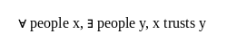
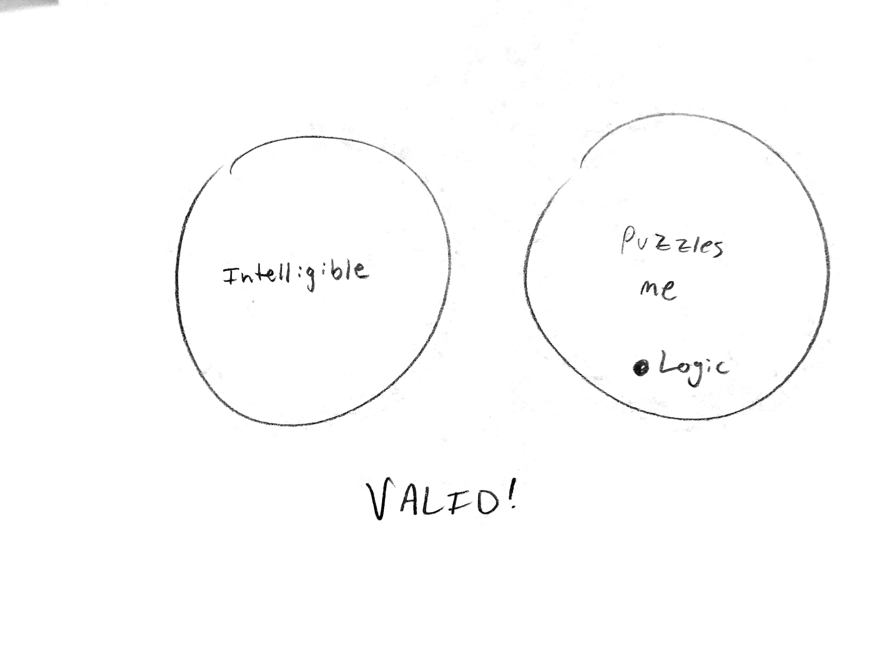
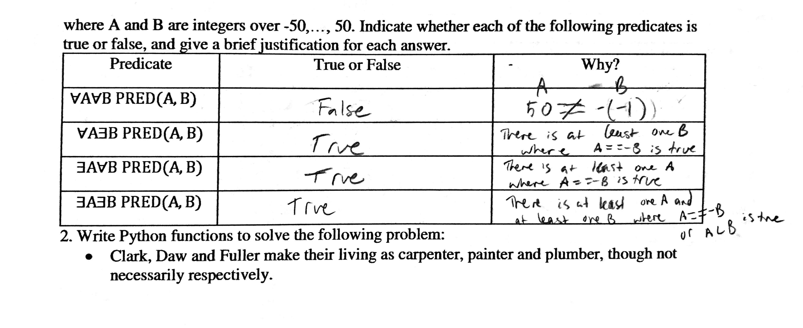

## Section 3.1
7d) {-2,-1,1,2}  
* 23b)  
"For all x, if x is a computer science student, then x must take data structures."  
"For all computer science students x, x must take data structures  
* 24b)  
"There exists a question x such that x is easy."  
"There exists x such that x is a question and x is easy."

## Section 3.2
* 10) "There exists computer program P such that P compiles without error messages and P is incorrect."  
* 9) "There exists an integer n such that n is prime an n is not odd an n does not equal 2."  
* 29) "For all n inside Z, if n is prime then n is odd or n = 2."  
**Converse:** "For all n inside Z, if n is odd or n = 2 then n is prime." This is false. If n = 15, 15 is not a prime number.  
**Inverse:** "For all n inside Z, if n is not prime then n isi even and n does not equal 2." This is false. If n = 15, 15 is not prime and not even.  
**Contrapositive:** "For all n inside Z, if n is even or n does not equal 2, then n is not prime." This is true.
* 40) "If a number is divisible by 8 then the number is divisible by 4."

## Section 3.3
* 26)  a) False. b and c are not above triangle d.  
b) There exists a circle x and there exists a triangle y such that x is not above y.

* 35)  a) For all people x and for some people y  
  
b) somebody trusts nobody  

## Section 3.4
* 11) False, converse error.  
* 12) False, inverse error.  
* 13) True, universal modus ponens.  
* 18) True, universal modus tollens.  

* 27) Valid  

## Additional Problems

1.  

2.